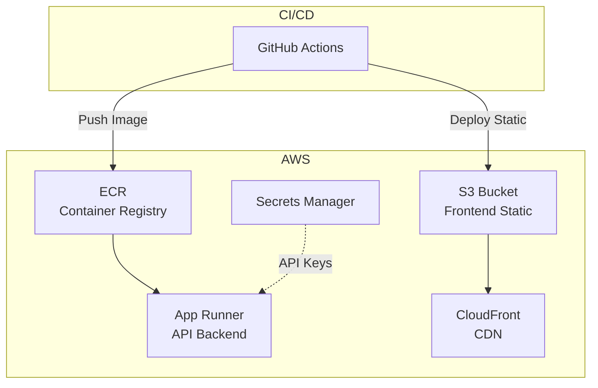

# AWS Deployment Strategy

Modern, cost-effective deployment with DevOps learning opportunities.

## Architecture

---

## Why This Architecture?

### Comparison with Alternatives

| Factor      | **App Runner** (Chosen) | **EC2**               | **Elastic Beanstalk** |
| ----------- | ----------------------- | --------------------- | --------------------- |
| Management  | Fully managed           | You manage everything | Semi-managed          |
| Scaling     | Auto, pay per use       | Manual or ASG config  | Auto, but complex     |
| Setup time  | ~10 min                 | Hours                 | ~30-60 min            |
| Cold starts | ~1-2s                   | None (always on)      | None                  |

### Cost Comparison (Low-Traffic Site)

| Option            | Monthly Cost | Notes                            |
| ----------------- | ------------ | -------------------------------- |
| **App Runner**    | **~$5-15**   | Scales down when idle            |
| EC2 (t3.micro)    | ~$8-10       | Paying 24/7, even with 0 traffic |
| EC2 (t3.small)    | ~$15-20      | More headroom                    |
| Elastic Beanstalk | ~$15-25      | Load balancer alone is ~$16/mo   |

### Why NOT EC2?

- Pay 24/7 even with zero traffic
- You manage: security patches, OS updates, monitoring, restarts
- Need VPC, security groups, Elastic IP, SSL certs manually
- Overkill for a simple API

### Why NOT Elastic Beanstalk?

- Load Balancer minimum cost ~$16/month
- More complex than needed for single-container app
- Slower deployments
- Abstracts too much (or not enough) for learning

### Bottom Line

For a personal portfolio/digital twin with sporadic traffic, App Runner gives the best cost/simplicity ratio while teaching real DevOps skills. For high-traffic production apps, EC2 or ECS would make more sense.

---

## DevOps Skills You'll Learn

| Component       | Skill                  | Why It Matters                         |
| --------------- | ---------------------- | -------------------------------------- |
| GitHub Actions  | CI/CD pipelines        | Automates build, test, deploy          |
| Terraform       | Infrastructure as Code | Reproducible, version-controlled infra |
| AWS ECR         | Container registry     | Store Docker images securely           |
| App Runner      | Serverless containers  | Zero-config, auto-scaling API hosting  |
| S3 + CloudFront | Static hosting + CDN   | Fast, cheap frontend delivery          |
| Secrets Manager | Secrets management     | Secure API key storage                 |

---

## Implementation Steps

### 1. GitHub Actions CI/CD

Create `.github/workflows/deploy.yml`:

- Build and push API Docker image to ECR
- Trigger App Runner deployment
- Build Next.js and sync to S3
- Invalidate CloudFront cache

### 2. Terraform Infrastructure

Create `infra/` directory with:

- `main.tf` - ECR, App Runner, S3, CloudFront, Secrets Manager
- `variables.tf` - Configurable parameters (region, domain, etc.)
- `outputs.tf` - Output URLs and resource IDs

---

## Cost Estimate

| Service         | Free Tier         | Expected Cost    |
| --------------- | ----------------- | ---------------- |
| App Runner      | 1M requests/month | ~$5-15/month     |
| S3              | 5GB storage       | ~$0.50/month     |
| CloudFront      | 1TB/month         | ~$0-2/month      |
| ECR             | 500MB storage     | Free             |
| Secrets Manager | -                 | ~$0.40/month     |
| **Total**       |                   | **~$6-18/month** |

---

## Prerequisites

1. **AWS Account** with admin access
2. **AWS CLI** configured locally (`aws configure`)
3. **Terraform** installed (`brew install terraform`)
4. **GitHub repo** with the following secrets:
   - `AWS_ACCESS_KEY_ID`
   - `AWS_SECRET_ACCESS_KEY`
   - `GROQ_API_KEY`
   - `GROQ_BASE_URL`

---

## Verification Checklist

- [ ] Docker builds successfully
- [ ] Terraform plan shows no errors
- [ ] API health check passes
- [ ] Frontend loads via CloudFront
- [ ] Chat works end-to-end
